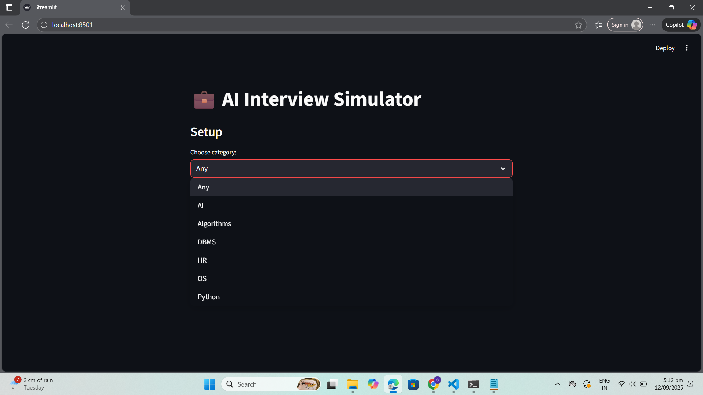

# Interview Preparation Chatbot

An **AI-powered interview simulator** that helps users practice common interview questions and receive instant feedback.

## 🚀 Features
- **Multiple Categories**: HR, DBMS, AI, OS, Algorithms, Python.
- **AI Evaluation**: Compares your answers with ideal ones using semantic similarity.
- **Keyword Analysis**: Highlights missing keywords.
- **Sentiment Check**: Flags negative or neutral tone.
- **Interactive Web App**: Built with Streamlit for an easy, browser-based experience.

## Screenshots

